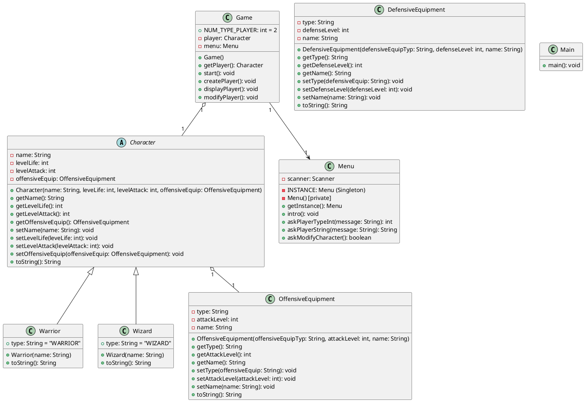
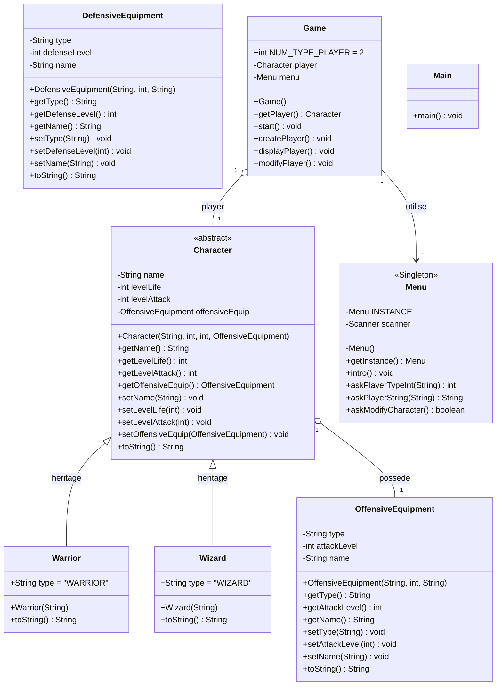

# Diagramme de Classe UML - Projet DonjonsDragons

Ce fichier contient les diagrammes de classe UML du projet DonjonsDragons au format **PlantUML** et **Mermaid**.

---

## 📊 Diagramme de Classe UML (Format PlantUML)



---

## 📊 Diagramme de Classe UML (Format Mermaid)



---

## 📋 Legende des Relations

| Symbole | Type de Relation | Description |
|---------|------------------|-------------|
| `<|--` | **Heritage** | `Warrior` et `Wizard` heritent de `Character` |
| `o--` | **Association** | `Character` possede un `OffensiveEquipment` |
| `-->` | **Dependance** | `Game` utilise `Menu` (via composition) |
| <<Singleton>> | **Pattern** | `Menu` est un Singleton |
| <<abstract>> | **Classe Abstraite** | `Character` est abstraite |

---

## 💡 Remarques & Suggestions d'Amelioration

1. **`DefensiveEquipment` n'est pas utilise** : La classe existe mais n'est pas integree dans `Character`. Tu pourrais ajouter :
   ```java
   private DefensiveEquipment defensiveEquip;
   ```

2. **Bug dans `Warrior.toString()`** : La methode affiche `"Wizard"` au lieu de `"Warrior"` (ligne 14)

3. **`Character` pourrait utiliser `DefensiveEquipment`** pour completer l'equipement

4. **Ajout possible** : Une classe `Equipment` (abstraite) comme parent de `OffensiveEquipment` et `DefensiveEquipment` pour factoriser le code commun
